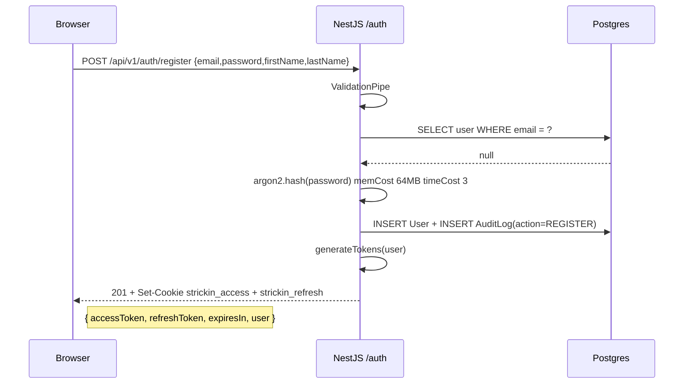
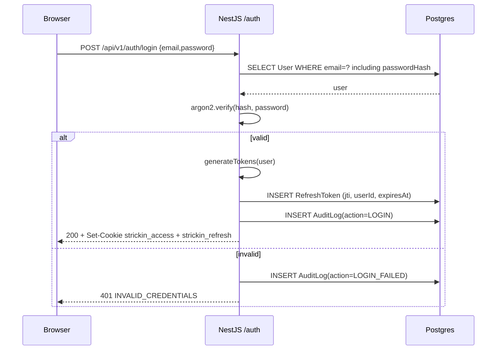
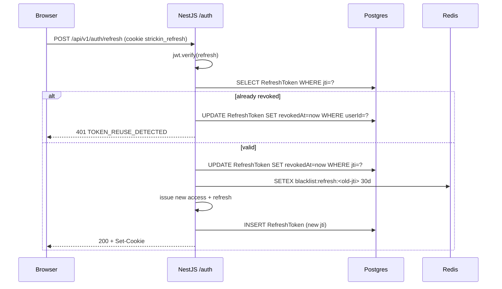

# 07 — Authentification

**Audience** : devs backend, devs frontend, security reviewer.
**Prerequisites** : JWT, HTTP cookies, hachage mot de passe.

---

## 1. Vue d'ensemble

- **Modele** : stateless, JWT HS256, Argon2id pour les mots de passe.
- **Two tokens** : access (15 min) + refresh (30 jours).
- **Rotation** : a chaque refresh, le refresh token est invalide et remplace.
- **Storage cote client** : cookies HttpOnly + Secure (prod) + SameSite=Lax.
- **Fallback header** : `Authorization: Bearer <token>` supporte pour les
  clients non-browser (CLI, mobile).

Les decisions sous-jacentes :
- [ADR 0008](./decisions/0008-argon2id-over-bcrypt.md) — Argon2id over bcrypt
- [ADR 0009](./decisions/0009-jwt-refresh-rotation.md) — Refresh rotation

## 2. Flow register



Details :
- Rate limit : `5 register/heure` par IP.
- L'email est normalise (trim + lowercase) avant lookup.
- Si conflit : 409 `EMAIL_ALREADY_REGISTERED` + audit log `REGISTER_FAILED`.
- Le role par defaut est `VIEWER` (sauf si role explicite accepte par la
  whitelist `resolveRegistrationTargets`).

## 3. Flow login



Details :
- Rate limit : `10 login/minute` par IP.
- Verify timing-safe (Argon2 gere le timing constant).
- On ne distingue **jamais** "email inconnu" de "password faux" dans la
  reponse — toujours `401 INVALID_CREDENTIALS`.

## 4. Tokens

### 4.1 Access token

- Format : JWT HS256.
- Claims :
  ```json
  {
    "sub": "clk1abc2xyz",
    "orgId": "clk1org-abc",
    "role": "CGP",
    "iat": 1713945600,
    "exp": 1713946500
  }
  ```
- TTL : **15 minutes**.
- Secret : `JWT_ACCESS_SECRET` (env var).

### 4.2 Refresh token

- Format : JWT HS256.
- Claims :
  ```json
  {
    "sub": "clk1abc2xyz",
    "jti": "clr1refresh...",
    "typ": "refresh",
    "iat": 1713945600,
    "exp": 1716537600
  }
  ```
- TTL : **30 jours**.
- Secret : `JWT_REFRESH_SECRET` (env var — distinct du access).
- Le `jti` est stocke dans la table `RefreshToken` pour revocation.

### 4.3 Rotation

Chaque appel a `/auth/refresh` :

1. Verifie la signature du refresh token.
2. Lit le `jti` dans la table `RefreshToken`.
3. Si le token est deja revoque → 401 + **revoque toute la famille** du
   user (defense contre token replay apres vol).
4. Marque l'ancien refresh comme `revokedAt = now()`.
5. Emet un nouveau couple access + refresh.
6. Retourne le nouveau couple.

Cela implemente le pattern **refresh token rotation** recommande par OWASP.



## 5. Cookies

### 5.1 Format

- `strickin_access` : httpOnly, Secure (prod), SameSite=Lax, path=/, maxAge=15 min.
- `strickin_refresh` : httpOnly, Secure (prod), SameSite=Lax, **path=/api/v1/auth**, maxAge=30 jours.

### 5.2 Pourquoi restreindre le path du refresh

Le refresh cookie ne part que vers `/api/v1/auth/*`. Sur toute autre URL,
le browser ne l'envoie pas. Cela reduit le risque CSRF et limite l'exposition
du token.

### 5.3 Cookies vs Bearer header

Les deux sont supportes :
- **Browser** : cookie automatique (rien a gerer cote front).
- **CLI / mobile** : `Authorization: Bearer <token>` et stockage local
  chiffre (keychain iOS, Keystore Android).

Le middleware Next.js (`apps/web/middleware.ts`) lit le cookie pour valider
que l'utilisateur est logue avant de servir les pages protected.

## 6. Logout

```
POST /api/v1/auth/logout
Cookie: strickin_access=...; strickin_refresh=...
```

- Ajoute le `jti` du refresh token dans la blacklist Redis (TTL = TTL
  restant du refresh).
- `DELETE` le row `RefreshToken` correspondant (ou `revokedAt`).
- Clear des deux cookies.
- Status 204.

## 7. JwtAuthGuard

Chaque controller protected utilise `@UseGuards(JwtAuthGuard)`. Le guard :

1. Lit `Authorization` header OU `strickin_access` cookie.
2. Verifie la signature.
3. Check la blacklist Redis (access tokens blacklists sont rares — seulement
   en cas de compromise signalee).
4. Charge l'user depuis la DB (select minimal : `id, email, role, orgId`).
5. Attache a `request.user`.

Les controllers recoivent l'user via `@CurrentUser()` decorator.

## 8. Autorisation (authz)

### 8.1 RolesGuard

```ts
@UseGuards(JwtAuthGuard, RolesGuard)
@Roles(UserRole.ORG_ADMIN, UserRole.SUPER_ADMIN)
@Get('admin/users')
listUsers() { /* ... */ }
```

### 8.2 OrgIsolationGuard

Pour les ressources scopes organisation, le guard compare automatiquement
`request.user.orgId` a `resource.orgId` avant d'executer le controller.

### 8.3 Policy-based (Sprint 3)

Pour les cas complex (un CGP peut voir une RFQ d'un client seulement s'il
en est le manager), on introduit un `CaslAbility` (librairie `@casl/ability`)
dans Sprint 3.

## 9. Password policy

Contraintes cote DTO :

| Regle | Valeur |
| --- | --- |
| Longueur min | 12 |
| Longueur max | 128 |
| Classes obligatoires | Aucune (on compte sur la longueur) |
| Liste noire | Pwned passwords API (Sprint 2) |

Rationnel : NIST SP 800-63B deconseille les regles de complexite
("1 special char, 1 uppercase, ..."), elles poussent les users vers
`Password1!`. Une longueur min de 12 + liste noire est plus efficace.

Frontend : composant `password-strength` (zxcvbn-like) mais indicatif
seulement — l'API est la source de verite.

## 10. Rate limiting

Via `@nestjs/throttler` :

| Endpoint | Limite |
| --- | --- |
| `POST /auth/login` | 10 / minute / IP |
| `POST /auth/register` | 5 / heure / IP |
| `POST /auth/refresh` | 30 / minute / IP |
| `GET /auth/me` | illimite (mais guard auth obligatoire) |

Sprint 2 : storage Upstash Redis (actuellement in-memory).

Sprint 3 : rate limit par **user** (pas seulement IP), surtout sur les
endpoints qui consomment du Claude (5 prompts/minute/user).

## 11. Security headers

Configures dans `main.ts` via `helmet` (a ajouter en Sprint 2) :

```
Content-Security-Policy: default-src 'self'; script-src 'self' https://vercel.live; style-src 'self' 'unsafe-inline'
Strict-Transport-Security: max-age=31536000; includeSubDomains
X-Frame-Options: DENY
X-Content-Type-Options: nosniff
Referrer-Policy: strict-origin-when-cross-origin
Permissions-Policy: camera=(), microphone=(), geolocation=()
```

## 12. CORS

```ts
app.enableCors({
  origin: [
    'https://strickin-web.vercel.app',
    /^https:\/\/.*-strickin\.vercel\.app$/, // previews
    'http://localhost:3000',                // dev
  ],
  credentials: true, // cookies
  methods: ['GET', 'POST', 'PATCH', 'DELETE', 'OPTIONS'],
});
```

## 13. Demo mode (frontend)

Le frontend possede un **demo mode** via la flag `NEXT_PUBLIC_USE_REAL_API=false` :
- Auth est pilotee par Zustand `auth.store.ts`.
- 3 comptes predefinis dans `DEMO_USERS` (CGP, admin, viewer).
- Pas d'appel backend — tout vit dans `localStorage` + cookie
  `strickin-auth` (distinct de `strickin_access`).

Usage : demo client sans backend deploye, tests E2E partiels.

**Attention** : en prod, `NEXT_PUBLIC_USE_REAL_API=true` obligatoire.

## 14. Menaces couvertes vs non couvertes

### 14.1 Couvert

- Password leak via hash weakness → Argon2id.
- Brute force → rate limit + lockout apres N echecs (Sprint 3).
- Replay attack refresh token → rotation + detection.
- CSRF → SameSite=Lax + path scope refresh.
- XSS vol de token → HttpOnly cookie.
- Session fixation → token regenere a chaque login.

### 14.2 Non couvert (Sprint 1)

- 2FA (TOTP / WebAuthn) → Sprint 3 (roadmap).
- Device fingerprinting → Sprint 3.
- SSO SAML / OIDC → Sprint 4.
- Password reset email flow → Sprint 2.

## 15. Flow complet — recap diagramme

Voir [`diagrams/auth-flow.md`](./diagrams/auth-flow.md).

## 16. Fichiers de reference

- Controller : `apps/api/src/auth/auth.controller.ts`
- Service : `apps/api/src/auth/auth.service.ts`
- Strategie JWT : `apps/api/src/auth/strategies/`
- Guards : `apps/api/src/auth/guards/`, `apps/api/src/common/guards/`
- Feature frontend : `apps/web/features/auth/`
- Middleware Next : `apps/web/middleware.ts`
- Sample audit logs : table `AuditLog` (via Prisma studio)
