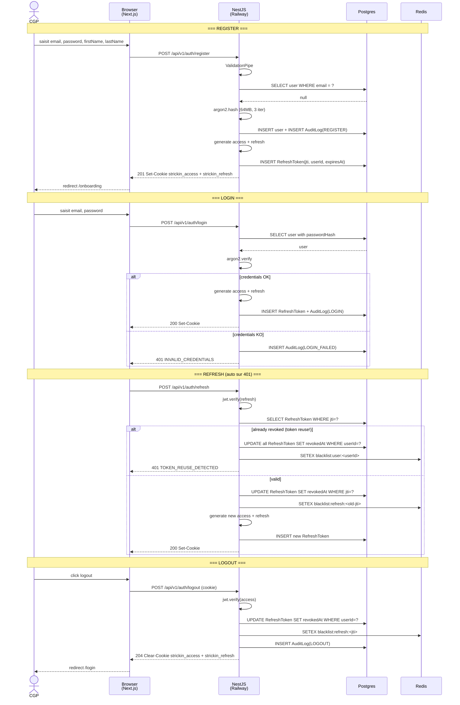
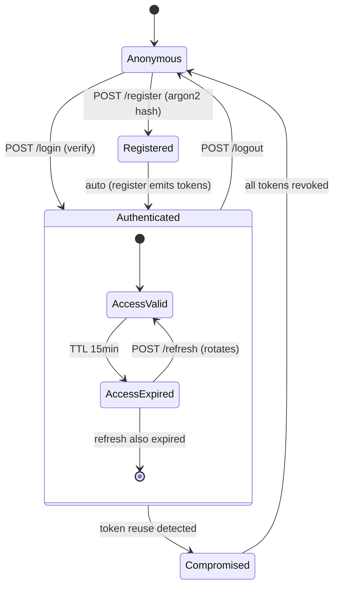

# Diagramme — Flow d'authentification

Register, login, refresh rotation, logout. Voir aussi
[`07-authentication.md`](../07-authentication.md).

---

## Vue Mermaid — global



## Vue Mermaid — state machine tokens



## Vue ASCII — refresh rotation detaille

```
  T=0                T=15m              T=16m
  ├──────── access token valid ─────┤
  │                                 │
  │                                 ▼
  │                          API call retourne 401
  │                                 │
  │                                 ▼
  │                          B: POST /auth/refresh
  │                                 │
  │                          ┌──────┴──────┐
  │                          │             │
  │                          │       jwt.verify(refresh)
  │                          │             │
  │                          │       lookup RefreshToken(jti)
  │                          │             │
  │                          │       ┌─────┴─────┐
  │                          │       │           │
  │                          │   valid     already revoked
  │                          │       │           │
  │                          │       ▼           ▼
  │                          │   rotate      REUSE DETECTED
  │                          │       │           │
  │                          │       ▼           ▼
  │                          │   revoke old   revoke FAMILY
  │                          │   issue new      (all tokens
  │                          │       │          of user)
  │                          │       │           │
  │                          │   200 new     401 FORCED LOGOUT
  │                          │   cookies
  │                          │       │
  │                          └───────┘
  │                                 │
  T=16m                             ├────────── new access valid ────
```

## Points cles

### 1. Rotation systematique
Chaque refresh invalide l'ancien token et emet un nouveau couple.
Un attaquant qui a vole un refresh n'a qu'une fenetre courte (avant le
prochain refresh legitime du user) pour l'utiliser.

### 2. Reuse detection
Si un refresh deja revoque est reutilise, on considere que le token a
ete vole. On invalide **toute la famille** de tokens du user (logout
force sur toutes ses sessions).

### 3. Cookies path-scoped
Le refresh cookie n'est envoye qu'a `/api/v1/auth/*` — reduit
l'exposition XSS.

### 4. Rate limiting
- Register : 5/h par IP.
- Login : 10/min par IP.
- Refresh : 30/min par IP.

### 5. Audit trail
Chaque action (register, login, login_failed, logout, refresh_reused)
ecrit dans `AuditLog` (table Prisma).

## Frontend — auto refresh

Le client API (`apps/web/lib/api/`) intercepte les 401 :

```ts
// pseudo-code
async function fetchWithRefresh(input, init) {
  let response = await fetch(input, init);
  if (response.status === 401 && !input.includes('/auth/')) {
    // try refresh
    const refreshResp = await fetch('/api/v1/auth/refresh', { method: 'POST', credentials: 'include' });
    if (refreshResp.ok) {
      // retry original
      response = await fetch(input, init);
    } else {
      // force logout
      window.location.href = '/login';
    }
  }
  return response;
}
```

Un seul refresh concurrent via mutex (pour ne pas en declencher plusieurs
en meme temps sur des requetes paralleles).

## Lectures complementaires

- [`07-authentication.md`](../07-authentication.md)
- [ADR 0008 — Argon2id](../decisions/0008-argon2id-over-bcrypt.md)
- [ADR 0009 — JWT rotation](../decisions/0009-jwt-refresh-rotation.md)
- [apps/api/src/auth/auth.controller.ts](../../../apps/api/src/auth/auth.controller.ts)
