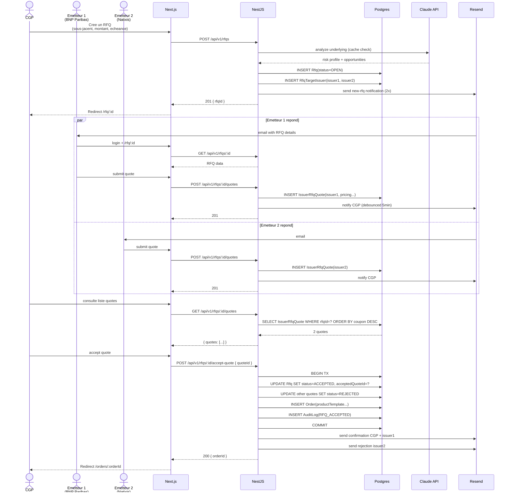

# Diagramme — Flow de donnees RFQ

Un CGP emet un Request-For-Quote, plusieurs emetteurs proposent des
quotes, le CGP accepte la meilleure. C'est le flow central metier de
Strick'in.

---

## Vue Mermaid — sequence



## Vue ASCII — timeline

```
 T=0         T=10min      T=1h          T=1h10      T=1h15       T=2h
  │           │            │             │           │             │
  │  CGP      │ Emetteur 1 │ Emetteur 2  │ CGP       │ Accept      │ Order
  │  POST     │ POST quote │ POST quote  │ consulte  │ quote #1    │ cree
  │  /rfqs    │            │             │ liste     │             │
  │  (new)    │            │             │           │             │
  ▼           ▼            ▼             ▼           ▼             ▼
 ┌──────┐   ┌──────┐    ┌──────┐      ┌──────┐   ┌──────┐       ┌──────┐
 │ RFQ  │   │Quote1│    │Quote2│      │ LIST │   │ACCEPT│       │ORDER │
 │      │   │      │    │      │      │      │   │      │       │      │
 │status│   │status│    │status│      │      │   │status│       │      │
 │=OPEN │   │=PEND │    │=PEND │      │      │   │=ACC  │       │=OPEN │
 │      │   │rfq=ID│    │rfq=ID│      │      │   │      │       │      │
 │      │   │issuer│    │issuer│      │      │   │other │       │      │
 │      │   │=BNP  │    │=NAT  │      │      │   │quote │       │      │
 │      │   │coupon│    │coupon│      │      │   │s set │       │      │
 │      │   │= 8.0%│    │= 7.5%│      │      │   │=REJ  │       │      │
 └──────┘   └──────┘    └──────┘      └──────┘   └──────┘       └──────┘
```

## Tables Prisma impliquees

```
Rfq                          IssuerRfqQuote            Order
├─ id                        ├─ id                     ├─ id
├─ cgpUserId                 ├─ rfqId                  ├─ rfqId
├─ underlyingIsin            ├─ issuerId               ├─ productTemplateId
├─ requestedAmount           ├─ productTemplate JSON    ├─ amount
├─ maturityYears             ├─ couponPct              ├─ status (OPEN/..)
├─ status (OPEN/ACCEPTED/    ├─ barrierPct             ├─ createdAt
│          CANCELLED)        ├─ autocallBarrierPct     │
├─ acceptedQuoteId           ├─ sri                    │
├─ createdAt                 ├─ status (PENDING/       │
├─ expiresAt                 │         ACCEPTED/
│                            │         REJECTED)
│                            ├─ createdAt
│                            ├─ respondedAt
```

## Indexes utilises

- `Rfq(status, createdAt)` — requetes "liste RFQs ouvertes recentes"
  par emetteur.
- `IssuerRfqQuote(rfqId, status)` — "toutes les quotes pending pour une
  RFQ".
- `IssuerRfqQuote(issuerId, respondedAt)` — stats emetteur.

Voir [`05-data-layer.md`](../05-data-layer.md#26-index-strategy).

## Transactions critiques

### 1. Accept quote
```
BEGIN
  UPDATE Rfq SET status='ACCEPTED', acceptedQuoteId=?
  UPDATE IssuerRfqQuote SET status='REJECTED' WHERE rfqId=? AND id != ?
  UPDATE IssuerRfqQuote SET status='ACCEPTED' WHERE id = ?
  INSERT Order (derived from quote + rfq)
  INSERT AuditLog(action='RFQ_ACCEPTED')
COMMIT
```

Transaction obligatoire — on ne peut pas avoir deux quotes ACCEPTED pour
la meme RFQ.

### 2. Cancel RFQ
```
BEGIN
  UPDATE Rfq SET status='CANCELLED'
  UPDATE IssuerRfqQuote SET status='REJECTED' WHERE rfqId=? AND status='PENDING'
  INSERT AuditLog(action='RFQ_CANCELLED', reason=...)
COMMIT
```

## Events publies

- `rfq.created` → declenche notifications emetteurs.
- `quote.submitted` → declenche notification CGP (debounced).
- `rfq.accepted` → declenche creation Order, notifications, update
  inventory produits.
- `rfq.cancelled` → notifications, cleanup.

En Sprint 2 : ces events passent par un outbox pattern (table
`OutboxEvent` + BullMQ worker) pour garantir at-least-once delivery meme
si un email bounce.

## Points d'attention

### Races
Deux CGPs qui acceptent la meme quote en meme temps. Protection :
`UPDATE Rfq SET status='ACCEPTED' WHERE id=? AND status='OPEN'` — si
0 rows affected, la RFQ n'est plus OPEN, on throw `RfqNotOpenError`.

### Expiration
Une RFQ a un `expiresAt` (typique 24h). Un cron (Sprint 2) marque les
RFQ expirees comme `CANCELLED` et reject les quotes pending.

### Compliance
Chaque accept / reject genere un `AuditLog` pour les 5 ans de retention
AMF.

### IA context
Avant de creer une RFQ, le CGP peut demander une analyse du sous-jacent
via `/api/v1/ai/analyze/:ticker`. La reponse (cached Redis) enrichit
l'UX mais n'est **pas** stockee dans la RFQ — c'est un outil d'aide a
la decision, pas un element du contrat.

## Lectures complementaires

- [`03-backend-architecture.md`](../03-backend-architecture.md) —
  pattern CQRS light.
- [`05-data-layer.md`](../05-data-layer.md) — indexes RFQ.
- [`08-observability.md`](../08-observability.md) — event tracking.
- Domain types : [`packages/shared/src/domain/rfq.ts`](../../../packages/shared/src/domain/rfq.ts)
