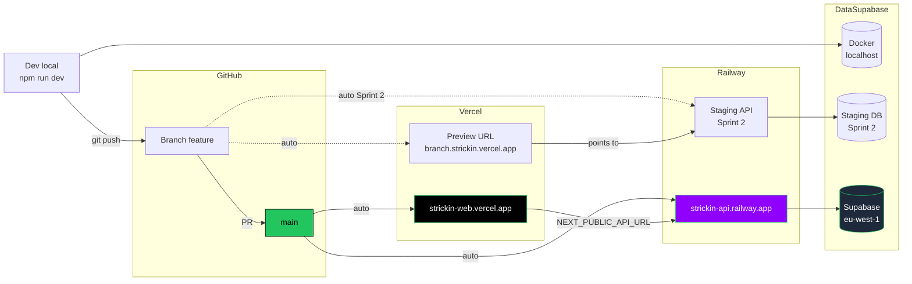

# Diagramme — Topologie de deploiement

Environnements, promotion, rollback.

---

## Vue Mermaid — environnements



## Vue ASCII — flux deploy prod

```
Developer
    │
    │ git push origin feature/xyz
    ▼
┌───────────────────────────────────────────────────┐
│ GitHub — branche feature                          │
└────────┬───────────────────────────────┬──────────┘
         │                               │
         │ auto webhook                  │ auto webhook
         ▼                               ▼
┌──────────────────┐             ┌──────────────────┐
│ Vercel preview   │             │ Railway preview  │
│ build + deploy   │             │ (Sprint 2)       │
└──────────────────┘             └──────────────────┘
         │
         │ Review OK, merge PR
         ▼
┌───────────────────────────────────────────────────┐
│ GitHub — main                                     │
└────────┬───────────────────────────────┬──────────┘
         │                               │
         │ auto webhook                  │ auto webhook
         ▼                               ▼
┌──────────────────┐             ┌──────────────────┐
│ Vercel prod      │             │ Railway prod     │
│ 1. npm install   │             │ 1. docker build  │
│ 2. next build    │             │ 2. release cmd:  │
│ 3. upload SRC    │             │    prisma deploy │
│    maps to Sentry│             │ 3. start node    │
│ 4. switch DNS    │             │    dist/main     │
│ 5. create release│             │ 4. health check  │
│    in Sentry     │             │ 5. switch traffic│
└────────┬─────────┘             └─────────┬────────┘
         │                                  │
         │                                  │
         ▼                                  ▼
 strickin-web.vercel.app         strickin-api.railway.app
                                            │
                                            ▼
                                  ┌──────────────────┐
                                  │ Supabase Postgres│
                                  │ migrations       │
                                  │ deja applied     │
                                  │ (pre-rollout)    │
                                  └──────────────────┘
```

## Order de deploy en cas de migration

```
T=0      Merge PR avec migration
         │
T=0s     Railway build Docker image
         │
T=40s    Railway execute release command:
         prisma migrate deploy
         │
T=42s    ┌─ SI migration OK ──▶ continue
         │
         └─ SI migration KO ──▶ STOP deploy, ancien container continue
         │
T=45s    Railway demarre nouveau container
         │
T=50s    Railway health check GET /health
         │
T=55s    Railway switch traffic (rolling)
         │
T=60s    Ancien container drained + killed
         │
T=70s    Vercel deploy (si changements front)
         │
T=90s    Vercel switch DNS
         │
T=100s   Old Vercel deployment kept for rollback
```

## Rollback — 3 cas

### Cas A — bug front pur

```
1. Vercel dashboard → Deployments
2. Selectionner le deploy "Stable" precedent
3. Promote to Production
4. DNS flip ~30s
5. Done
```

### Cas B — bug api sans migration

```
1. Railway dashboard → Deployments
2. Rollback vers deploy precedent
3. Attendre health check ~1min
4. Done
```

### Cas C — bug api avec migration destructive

```
1. STOP — ne pas juste rollback le container
   (la DB a deja une schema > code ancien)
2. Option 1 — forward fix
   a. Ecrire une migration de compatibilite qui remet l'ancienne
      shape (ex: recreate colonne dropped)
   b. Push urgence sur main
   c. Deploy comme d'habitude
3. Option 2 — rollback complet
   a. git revert du commit de migration
   b. creer une migration inverse (drop de ce qu'on a ajoute,
      rename back si rename, etc.)
   c. applyer manuellement via psql
   d. deploy l'ancien code
   (complexe, a eviter — cf. regle additive-only en
   05-data-layer.md)
```

## Secrets management

```
Sprint 1 (actuel) :
   Developer
   ┌────────────┐
   │ 1Password  │──┬──▶ .env.local (local)
   │ "Strickin  │  │
   │  Sprint 1" │  ├──▶ Vercel UI (prod web)
   └────────────┘  │
                   └──▶ Railway UI (prod api)

Sprint 2 :
   ┌────────────┐
   │  Doppler   │──┬──▶ Local CLI (doppler run)
   │            │  │
   │            │  ├──▶ Vercel integration natif
   │            │  │
   │            │  └──▶ Railway integration natif
   └────────────┘
```

## Environnements matrice

| Env | Next URL | API URL | DB | Migrations |
| --- | --- | --- | --- | --- |
| Dev | `localhost:3000` | `localhost:4000` | Docker compose | `prisma migrate dev` |
| Preview | `<branch>-strickin.vercel.app` | staging Railway (S2) | staging Supabase (S2) | auto au deploy staging |
| Staging (S2) | `staging.strickin.fr` | `staging-api.strickin.fr` | staging Supabase | auto |
| Prod | `strickin-web.vercel.app` | `strickin-api.railway.app` | prod Supabase eu-west-1 | `prisma migrate deploy` Railway release cmd |

## Monitoring post-deploy

```
Deploy complete
      │
      ▼
┌────────────────────────┐
│ Sentry release created │
│ (SHA-based)            │
└────────┬───────────────┘
         │
         ▼
┌────────────────────────┐
│ Slack #deploys notify  │ (Sprint 2)
└────────┬───────────────┘
         │
         ▼
┌────────────────────────┐
│ Watch pour 30 min      │
│ - Error rate           │
│ - Latency p95          │
│ - /ready health        │
└────────────────────────┘
```

## Lectures complementaires

- [`10-deployment.md`](../10-deployment.md)
- [`05-data-layer.md`](../05-data-layer.md) — migration strategy detail.
- [`runbook-incidents.md`](../../runbook-incidents.md)
