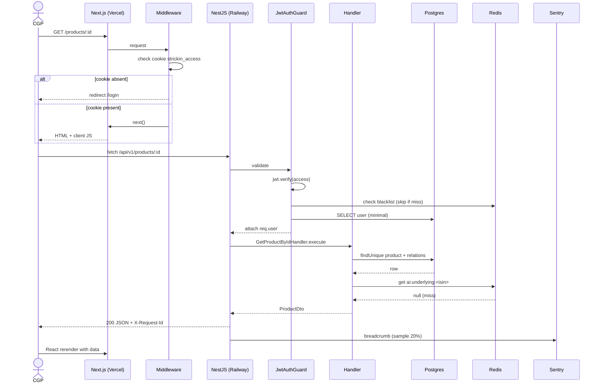

# Diagramme — Flow d'une requete authentifiee

Cycle complet d'un `GET /api/v1/products/:id` quand le user est logue.

---

## Vue ASCII

```
┌──────────┐
│ Browser  │
│ CGP app  │
└────┬─────┘
     │ 1. Click "Voir produit" → router.push('/products/:id')
     │
     ▼
┌─────────────────────────────────────────────────────────┐
│ Next.js App Router (Vercel)                             │
│                                                         │
│ 2. middleware.ts lit cookie strickin_access             │
│    - si absent → redirect /login                        │
│    - si present → renders page                          │
│                                                         │
│ 3. page.tsx (Server Component)                          │
│    - aucune fetch cote serveur (reserve aux publics)    │
│    - rend <ProductDetailClient productId={id} />        │
│                                                         │
│ 4. ProductDetailClient (Client Component)               │
│    - useProduct(id) → TanStack Query                    │
│    - queryKey = ['products','detail', id]               │
│    - queryFn = productApi.getById(id)                   │
│                                                         │
│ 5. productApi.getById(id)                               │
│    - fetch '/api/v1/products/:id'                       │
│      avec Authorization: Bearer <token>                 │
│      et credentials: 'include' (cookies)                │
└────────────────────┬────────────────────────────────────┘
                     │ HTTPS
                     ▼
┌─────────────────────────────────────────────────────────┐
│ NestJS API (Railway)                                    │
│                                                         │
│ 6. LoggingInterceptor: genere requestId, log INCOMING   │
│                                                         │
│ 7. RateLimitGuard (throttler)                           │
│    - KO 429 si depassement                              │
│                                                         │
│ 8. JwtAuthGuard                                         │
│    - lit cookie OR Authorization header                 │
│    - jwt.verify(token, JWT_ACCESS_SECRET)               │
│    - KO 401 si invalid                                  │
│    - check blacklist Redis (rare, skip si miss)         │
│                                                         │
│ 9. OrgIsolationGuard (si product scoped org)            │
│    - compare request.user.orgId vs product.orgId        │
│                                                         │
│ 10. ProductsController.findById(id)                     │
│     → GetProductByIdHandler.execute({id})               │
│                                                         │
│ 11. Handler                                             │
│     a. Prisma product.findUnique with relations         │
│        (issuer, targetMarket, kidDoc)                   │
│     b. Si null → throw ProductNotFoundError             │
│     c. Check cache Redis ai:underlying:<isin>           │
│        - HIT: enrich avec analyse cached                │
│        - MISS: skip (analyse a part via GET /ai/...)    │
│     d. map to ProductDto                                │
│                                                         │
│ 12. Controller retourne { data: ProductDto }            │
│                                                         │
│ 13. LoggingInterceptor: log OUTGOING statusCode:200     │
│     durationMs, requestId                               │
│                                                         │
│ 14. Sentry breadcrumb pour trace                        │
│                                                         │
│ 15. Response headers:                                   │
│     X-Request-Id: req_01H...                            │
│     Cache-Control: no-store                             │
└────────────────────┬────────────────────────────────────┘
                     │ 200 JSON
                     ▼
┌─────────────────────────────────────────────────────────┐
│ Browser (Client Component continues)                    │
│                                                         │
│ 16. TanStack Query cache la response                    │
│     staleTime: 60s → pas de refetch immediate           │
│                                                         │
│ 17. ProductDetailClient rerender avec data              │
│                                                         │
│ 18. React rerender → virtual DOM → paint                │
└─────────────────────────────────────────────────────────┘
```

## Vue Mermaid (sequence)



## Cas d'echec

### 401 — token expired

```
11. JwtAuthGuard throw TokenExpiredError
12. Response 401 { code: 'TOKEN_EXPIRED' }

Frontend:
13. axios interceptor intercepts 401
14. POST /api/v1/auth/refresh (cookie strickin_refresh)
15. Si succes: retry original request
    Si echec: redirect /login
```

### 429 — rate limit

```
7. ThrottlerGuard throw
8. Response 429 + Retry-After: 30

Frontend:
9. axios interceptor intercepts 429
10. TanStack Query: retry logic (default: 3 tentatives exponential)
11. Si persiste: surface toast "Trop de requetes"
```

### 500 — DB down

```
11. prisma.product.findUnique throws PrismaClientKnownRequestError
12. ExceptionFilter maps to 503 (car infra fail)
13. Response 503 { code: 'SERVICE_UNAVAILABLE' }

Frontend:
14. TanStack Query retry avec exponential backoff
15. Si persiste 5min: Sentry issue + fallback UI "Service temporairement
    indisponible"
```

## Metrics observes

- `http_requests_total{method="GET",path="/products/:id",status="200"}` +1
- `http_request_duration_seconds{...}` observed ~120ms
- Request ID dans les logs API + Sentry

## Lectures complementaires

- [`07-authentication.md`](../07-authentication.md) — JwtAuthGuard detail.
- [`06-api-contracts.md`](../06-api-contracts.md) — response format.
- [`08-observability.md`](../08-observability.md) — logs / metrics.
