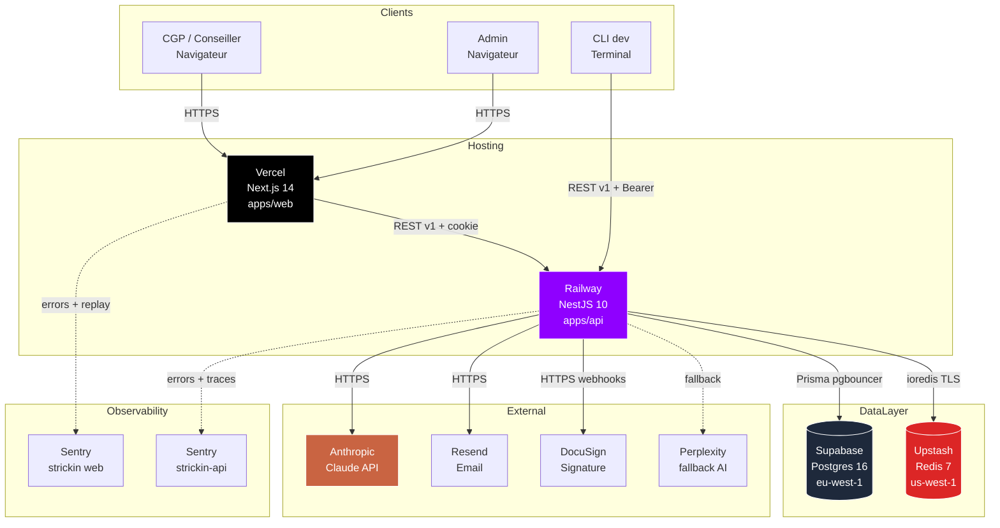

# Diagramme — Vue d'ensemble systeme

Topologie complete de la plateforme Strick'in (Sprint 1).

---

## Vue Mermaid (GitHub rend nativement)



## Vue ASCII (fallback si Mermaid desactive)

```
                          ┌────────────────────────────────┐
                          │             Clients            │
                          │  CGP  ·  Admin  ·  CLI dev     │
                          └───────────────┬────────────────┘
                                          │ HTTPS
                                          ▼
        ┌──────────────────────────────────────────────────────────────┐
        │                          Hosting                             │
        │                                                              │
        │  ┌────────────────────────┐       ┌────────────────────────┐│
        │  │ Vercel — Next.js 14    │──────▶│ Railway — NestJS 10     ││
        │  │ apps/web               │ REST  │ apps/api                ││
        │  │  RSC + TanStack Query  │ v1    │  Clean Arch + DDD       ││
        │  │  Zustand + middleware  │       │  Prisma ORM             ││
        │  └───────────┬────────────┘       └──────────┬──────────────┘│
        └──────────────┼──────────────────────────────┼────────────────┘
                       │                              │
                       │ Sentry                       │
                       ▼                              ▼
                ┌──────────────┐     ┌───────────────────────────────┐
                │   Sentry     │     │        Data layer             │
                │ strickin     │     │                               │
                │ strickin-api │     │  ┌───────────────────┐        │
                └──────────────┘     │  │ Supabase Postgres │        │
                                     │  │ eu-west-1         │        │
                                     │  └───────────────────┘        │
                                     │                               │
                                     │  ┌───────────────────┐        │
                                     │  │ Upstash Redis     │        │
                                     │  │ us-west-1         │        │
                                     │  └───────────────────┘        │
                                     └──────────────┬────────────────┘
                                                    │
                                                    ▼
                                     ┌───────────────────────────────┐
                                     │         External APIs         │
                                     │                               │
                                     │  Anthropic Claude (principal) │
                                     │  Perplexity (fallback AI)     │
                                     │  Resend (email)               │
                                     │  DocuSign (signature)         │
                                     └───────────────────────────────┘
```

## Composants cles

| Layer | Composant | Role |
| --- | --- | --- |
| Hosting web | Vercel | Deploy Next.js, preview PR, CDN global. |
| Hosting api | Railway | Deploy Docker NestJS, migrations Prisma. |
| DB | Supabase Postgres | Source de verite, EU residency. |
| Cache | Upstash Redis | Cache AI, blacklist tokens. |
| AI | Anthropic Claude | Analyses produits, ESG, sentiment. |
| Email | Resend | Emails transactionnels. |
| Signature | DocuSign | Signatures electroniques envelopes. |
| Monitoring | Sentry | Errors, replay, tracing. |

## Flux principaux

- **CGP se connecte** → Next.js → cookie → Railway → Supabase (verify) →
  JWT.
- **CGP consulte un produit** → Next.js → Railway → Supabase (produit) +
  Upstash (cache ISIN data) + Claude (analyse sous-jacent cache miss).
- **CGP cree une RFQ** → Next.js → Railway → Supabase → Claude (analyse)
  → Resend (notif emetteurs).
- **Emetteur soumet une quote** → Next.js emetteur → Railway → Supabase.
- **CGP accepte une quote** → Next.js → Railway → Supabase (Order) →
  DocuSign (Envelope) → attente signature client.

## Environnements

- **Prod** : URL ci-dessus.
- **Preview** : `https://<branch>-strickin.vercel.app` + staging Railway
  (Sprint 2).
- **Dev** : `localhost:3000` + `localhost:4000` + Docker compose
  (Postgres + Redis locaux).

Voir [`10-deployment.md`](../10-deployment.md) pour les env vars detailles.
